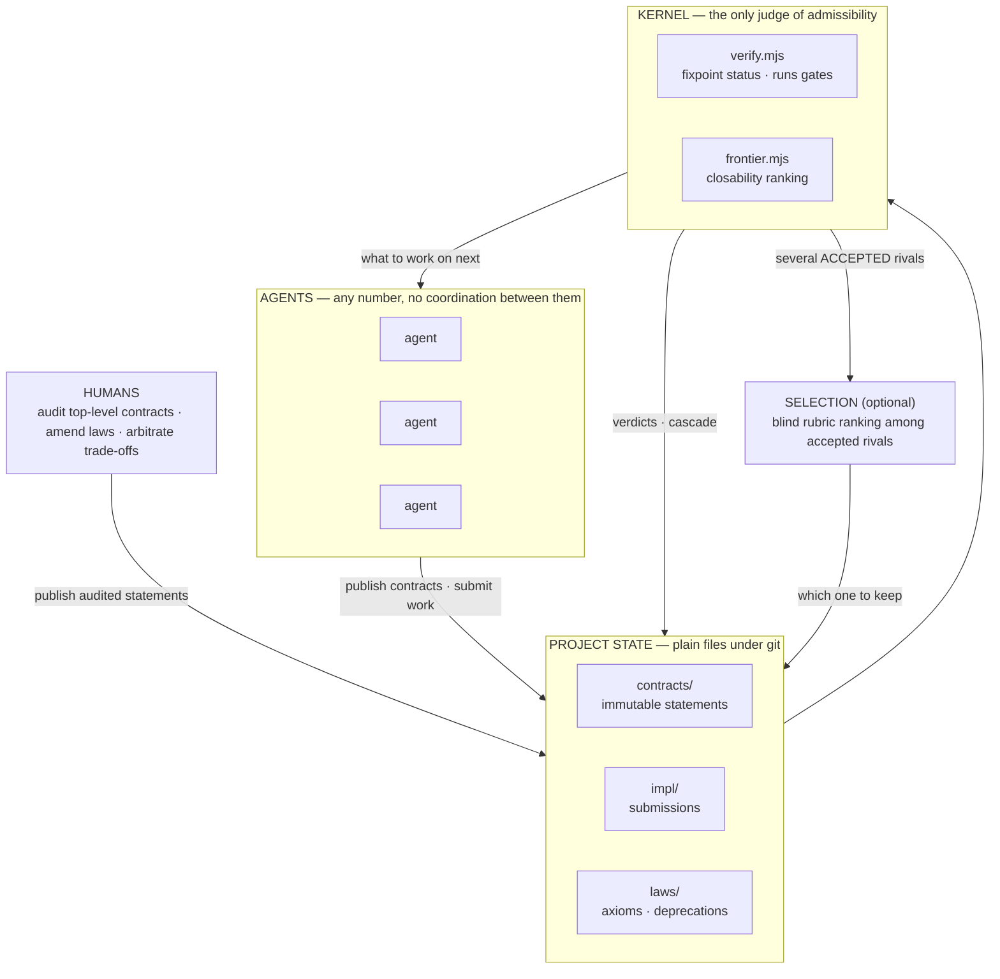

# build2me

**Map the solution space before you build the software — so a swarm of agents can
work in parallel without coordinating, and without a human reviewing code.**

Work is split into contracts, each carrying the command that decides whether
it is satisfied. Agents pick contracts off a ranked frontier without claiming
them, a verifier is the only judge, finished parts compose by cascade — and
contracts keep evolving as understanding grows, version by version, with the
reopened downstream routed automatically.

[Protocol](PROTOCOL.md) · [Stub semantics](STUBS.md) · [Rendered DAG](docs/DAG.md) · [Race 001](races/001-deprecation-cascade.md) · [中文](README.zh-CN.md)

[](https://github.com/shitianfang/build2me/actions/workflows/verify.yml)
**15 / 17 contracts Done · frontier empty · 2 statements revised live · built by a swarm under its own protocol**

```sh
node tools/init.mjs ../my-system --root my-system   # scaffold your own project
```

---

## Adoption is more than cloning

**Cloning into a subdirectory does not activate the protocol in the enclosing
project.** Bind it to the actual project-root agent entry before doing work.

- New projects: `init.mjs` now installs a managed block in root `AGENTS.md`,
  a `.build2me.json` receipt, and a verifier law checking that binding.
- Existing projects with a graph (including one in a subdirectory):

```sh
node /path/to/build2me/tools/adopt.mjs /path/to/project --graph work/map
node /path/to/build2me/tools/adopt.mjs /path/to/project --graph work/map --apply
node /path/to/project/work/map/tools/adopt.mjs /path/to/project --graph work/map --check
```

The first command is a **read-only preview**. Apply preserves project rules
outside one managed block, also merges an existing `CLAUDE.md`, copies binding
tools into the graph, and is repeatable. External graph/rule links, malformed
markers and conflicting owned files fail before writes. The target must be the
Git root when it belongs to a Git repository; do not target only the clone.

Read the complete protocol, publish task contracts, then use
**frontier → work → submission → verify → new frontier** for every stage.
If requested work is absent, extend/revise the graph; an empty frontier is not
permission to switch back to an off-map workflow. Root-rule drift fails the
installed law on the next verify pass.

This is a discoverable rule plus a checked binding, **not a sandbox or a
guarantee an LLM will obey it**. Gates still need to cover real acceptance.
Local safety, permissions, and required human reviews remain authoritative:
model-authored approval is not human signoff. Track those approvals as explicit
dependencies, rather than treating a technical PASS as approval.

## Why this exists

Point a swarm of agents at one codebase and the old ways break in two places:

1. **They collide on files.** Three agents editing the same module is a merge
   disaster.
2. **They queue behind review.** A PR needs a human to read it, and that human
   is the bottleneck — it does not matter how fast the agents are.

[Prove2Me](https://arxiv.org/abs/2608.28433) hit both of these first. Its
authors tried multi-agent co-editing (agents interfere) and a git PR workflow
(review stalls) before inventing anything, and answered by **moving trust from
review to immutable statements plus a checker**. In Lean that checker is free:
the compiler says it type-checks, and it is proved. On that footing a swarm of
Claude agents [formalized Fermat's Last Theorem in 11
days](https://www.anthropic.com/research/formalizing-fermats-last-theorem) —
30,300 theorems, with no human reviewing proofs during the run (Kevin Buzzard
reviewed the completed proof afterward).

build2me asks the obvious follow-up: **in software, what plays the part of the
compiler?**

The answer it commits to: **every unit of work carries its own acceptance
command.**

## Three objects

**1. Contract** — a statement of *what must be true*, silent about *how*. One
JSON file, and the `acceptance` command is the whole definition of done:

```json
{
  "name": "frontier-tool",
  "title": "Frontier query (the scheduler)",
  "interface": "CLI: node tools/frontier.mjs [--dir <project>] [--json]. Prints Open leaf contracts ranked by closability.",
  "acceptance": "node --test acceptance/frontier-tool.test.mjs",
  "nl_description": "Replaces task assignment. Any agent picks its next work item from this ranking; no locks, no claims.",
  "serves": "root",
  "env": "node>=20"
}
```

That one line settles it. There is no "close enough" and no "let me check with
someone" — the command exits 0 and the contract is Done, or it does not and the
contract is not.

**And contracts evolve — freely, at any time.** A title or description you
just edit in place. Changing what a contract *means* — interface, acceptance,
env — is one command:

```sh
node tools/revise.mjs search-index --set interface="..." --reason "positions are now required"
# -> contracts/search-index-v2.json is the live statement from here on
# -> everything downstream reopens automatically, and the frontier lists
#    each reopened contract with the new version to re-point at
```

Revise as often as understanding grows (`-v2`, `-v3`, …); abandon a whole
direction with a deprecation and the region stays on the map as explored
territory. Under the hood every version is its own permanent file — like git,
where you edit freely yet every commit is immutable. That implementation
detail is what buys three things at swarm scale: an agent mid-build never has
the statement swapped under it, humans audit only new statements (never
re-read old ones for sneaked edits), and everything ever verified stays
verifiable against exactly what it was verified for.

**2. Submission** — an attempt at a contract, in `impl/<contract>/<id>/meta.json`.
Either an `implementation`, or a `decomposition` that reduces the contract to
children it `imports`. Those imports are the DAG's edges:

```json
{ "contract": "calc", "kind": "decomposition", "imports": ["add", "mul"],
  "files": ["src/calc.mjs"], "notes": "calc implemented against add and mul" }
```

**3. Law** — one enforced floor per quality dimension, `laws/<id>.json`:

```json
{
  "id": "l5-tool-size",
  "dimension": "complexity",
  "statement": "no kernel tool exceeds 400 lines; split it or amend this law deliberately",
  "check": "node laws/checks/l5-tool-size.mjs"
}
```

The verifier runs every law's `check` on every pass and fails verification on
violation.

> *A law is only a law if something enforces it; prose without a check is
> advice.*

Laws are written when a problem bites, not in advance: measure today's level,
freeze it as the floor, and from then on that ground cannot be lost silently.
That is a **ratchet** — what went green may never quietly go red. Which
dimensions a project needs is discovered while building. `laws/laws.md` is the
human-readable index.

---

Everything else — statuses, verdicts, the work queue, completion — is
**derived** by the verifier. Nothing is stored, nothing is negotiated.

| term | meaning |
|---|---|
| `Open` / `Done` / `Deprecated` | a contract's derived status |
| `ACCEPTED` | the submission's imports are all Done and the contract's gate passed |
| `SKETCH_ACCEPTED` | a valid submission still waiting on Open children |
| `GATE_FAILED` | imports ready, gate ran, gate said no |
| **cascade** | when a sketch's last child closes, the *parent's* gate runs for real |
| **closability** | how many ancestors would auto-resolve if this leaf closed — the scheduler's only number |

## How it runs

The kernel is two tools:

- **`verify.mjs`** reads the project state, runs each contract's own acceptance
  command, and derives every status by fixpoint.
- **`frontier.mjs`** prints the Open contracts ranked by closability. That
  ranking is the work queue.

**The kernel decides admissibility, not quality.** A contract is Done exactly
when its gate passed. That is a binary, and binaries are blind to everything a
gate does not test. When several submissions pass the same gate, a second,
*optional* layer ranks them: blind pairwise review against a rubric written
before the solutions existed. Race 001 below is the receipt for why that layer
is in the diagram.

**Agents are interchangeable.** They read the frontier, do work, submit. So:

- nothing is reserved, so an agent never waits;
- a crashed agent blocks nobody;
- two agents on one contract is a **cost, never a conflict** — contracts are
  immutable, so anything ever built against one stays valid and there is
  nothing to arbitrate at merge time;
- the race rule is simply **first accepted wins**.

**The loop every agent runs:**

```sh
node tools/frontier.mjs          # 1. pick an Open contract, prefer high closability
                                 # 2. search existing contracts and submissions — reuse beats rebuilding
                                 # 3. implement it, or decompose it into new child contracts
node tools/verify.mjs            # 4. run the kernel locally until green
                                 # 5. submit — branch + PR; CI runs this same kernel
```



## What this is for

Three things matter when agents build something bigger than one session:

**1. A map of the solution space.** Which parts are solved — verified, and
nobody can quietly break them again. Which parts are still open. Which paths
were tried, failed, and why — kept, so the next agent doesn't pay for the same
dead end twice. The map is the repository itself: `contracts/` are the nodes,
verdicts mark the solved regions, failed submissions and deprecations mark the
explored dead ends, and `node tools/graph.mjs --format json` prints the whole
map — per-node attempt history, abandonment reasons, and each dimension's
floor — for any tool to render.

**2. Decomposition follows the task — it is never fixed up front.** At the
start you don't know what the right parts are, or which qualities will need
optimizing. So you split the task as you understand it today; when building
teaches you a better split, deprecate and re-split — history stays. Dimensions
are discovered the same way: a page that got slow, a module nobody can read, a
doc that lied.

**3. A foothold in every dimension, and ratchets everywhere.** "It works" is
one dimension; its foothold is the acceptance gate. Every other quality the
task turns out to need gets the same treatment the moment it bites. Progress
means closing open contracts and deliberately tightening floors. Never
backwards.

**The honest limit:** a task that fits inside one session's context is cheaper
done directly in that session. This pays off when the work outlives its
workers — sessions end; the map remains.

## Start your own project

Requires Node ≥ 20, git, and bash (for the immutability check). No npm
dependencies.

```console
$ git clone https://github.com/shitianfang/build2me
$ cd build2me
$ node tools/init.mjs ../my-system --root my-system
build2me project created at /.../my-system
  root contract: my-system    (14 files written)

next:
  1. edit contracts/my-system.json — say what the system must do
  2. node tools/verify.mjs --dir ../my-system     # green, root Open
  3. node tools/frontier.mjs --dir ../my-system   # your work queue
  4. decompose: publish child contracts with gates, then submit a
     decomposition on my-system that imports them (PROTOCOL.md)
```

You get the kernel, a root contract, a starter completion gate, `laws/`, a CI
workflow that runs the verifier and enforces immutability, and `PROTOCOL.md` for
the agents who will work there. Then: write what the system must do, publish
child contracts **each with its gate**, and submit a decomposition importing
them. From that point the frontier is your backlog.

To watch the mechanics first, this repo ships a miniature project — a sketched
parent (`calc`) over one Done child (`add`) and one Open child (`mul`):

```console
$ node tools/verify.mjs --dir acceptance/fixtures/demo
  add                          DONE
    sub-001                    implementation -> ACCEPTED
  calc                         OPEN
    dec-001                    decomposition -> SKETCH_ACCEPTED
  mul                          OPEN

  1 done, 2 open, 0 deprecated

$ node tools/frontier.mjs --dir acceptance/fixtures/demo
  closability  contract
  1            mul                          Multiplication
```

`mul` is the entire work queue, and `closability 1` says closing it also closes
`calc`. Implement `mul` and `calc`'s integration gate runs by cascade —
[acceptance/example-flow.test.mjs](acceptance/example-flow.test.mjs) does exactly
that, verified in CI.

## Tools

Every tool takes `--dir <project>` and defaults to the current directory.

| command | what it does |
|---|---|
| `node tools/init.mjs <dir> [--root <name>] [--force]` | Scaffolds a new project: kernel, root contract, starter gate, laws, CI. Refuses a non-empty directory unless forced; never overwrites. |
| `node tools/adopt.mjs <root> [--graph <relative-dir>] [--apply\|--check]` | Bind an existing graph to actual root rules; preview by default, preserve local rules, check adoption drift. |
| `node tools/verify.mjs [--json]` | **The kernel.** Validates structure, rejects cycles and self-imports, runs acceptance gates, derives statuses and verdicts by fixpoint. Non-zero on any structural error or failing gate. |
| `node tools/frontier.mjs [--json]` | **The scheduler.** Actionable Open contracts ranked by closability. |
| `node tools/graph.mjs [--format json\|mermaid\|dot]` | DAG export with derived statuses; edges styled by verdict. `dot` needs graphviz to render, `mermaid` renders on GitHub. |
| `node tools/stub.mjs <contract> [--format mjs\|dts] [--check]` | Materializes a contract's interface as a compilable stub, so a parent type-checks and loads before any child exists. `--check` keeps committed stubs honest in CI. |
| `node tools/deprecate.mjs <contract> --reason <text>` | Retires a statement (append-only) and names every dependent the verifier will now hold Open. |
| `node tools/revise.mjs <contract> --set field=value --reason <text>` | **How a contract evolves.** Publishes the successor (auto-named `-v2`, `-v3`, …) and deprecates the predecessor with a `superseded-by:` pointer, in one operation; the frontier then shows every reopened dependent with the successor to re-point at. |
| `node tools/serve.mjs [--port n]` | HTTP coordination API: contracts, submissions, frontier, graph, and search across submissions **including failed ones**. Unauthenticated — see Security. |
| `node tools/misalign.mjs [--since rev] [--json]` | Mines co-change history and reports file pairs the contract tree says are independent but history says are coupled. |
| `node tools/drill.mjs list\|record\|report` | Cold-agent comprehension drills with budgets, append-only results, trends. |
| `bash tools/check-immutability.sh <baseline>` | Guards the semantic core (name, interface, acceptance, env) of every contract; descriptive fields may be edited in place. Deprecation log append-only. Runs in CI on every push and PR. |

## Project layout

```
contracts/    one immutable JSON file per contract — the statements
impl/         submissions: impl/<contract>/<id>/meta.json + the artifacts
laws/         laws.md (the axiom system) + deprecations.log (append-only)
acceptance/   the gates: one test file per contract, plus the demo fixture
tools/        the kernel, the scheduler, and the instruments above
races/        parallel-attempt records: pre-registered rubrics and verdicts
drills/       cold-agent drill definitions and their append-only results
```

## This repository is self-hosting — and closed its own root

build2me was built under its own protocol, by a swarm. The system is the `root`
contract, decomposed into eleven children; the moment the last one closed,
root's own integration gate ran by cascade and accepted. `declared-laws` — the
third object, made machine-checked — was published afterwards and closed the
same way, then `contract-revision` — evolution made a one-command operation.

The revision machinery has since been used **on this repository itself,
twice**, which is why the badge reads 14 / 16: `immutability-check` was
revised to `-v2` when descriptive fields became editable in place (a typo fix
must not cost a revision), and `root` was revised to `-v2` because the v1
completion gate demanded *every node Done* — a criterion no repository with a
revised contract could ever satisfy again. Both predecessors sit in the DAG as
deprecated nodes with `superseded by` edges; during the second revision the
frontier itself displayed the repair
(`root  [re-point immutability-check -> immutability-check-v2]`). Today
`node tools/verify.mjs` reports **14 done / 0 open / 2 deprecated** and the
frontier is empty.

What the root-closing run actually cost, from the harness logs: **seven Opus
agent sessions** — three racing one contract, one judging them blind, three
closing frontier contracts in parallel — totalling about **62 minutes of agent
wall-clock** (far less elapsed, since they ran concurrently) and **~683k
subagent tokens**, plus the captain session that published contracts, audited
gates, and merged. Twelve contracts, twelve gates, one contract implemented
three times.

Two events are preserved because they are the protocol working.

### Race 001 — why passing the gate is not the same as being right

[Full record here.](races/001-deprecation-cascade.md) Three isolated agents
raced `deprecation-cascade` against a gate published before any of them started.

**All three passed.**

A blind pairwise rubric review, *pre-registered before any solution existed*,
then found a real defect in two of them: a legal contract name containing
whitespace made them print success while writing a log line the engine reads
back as a different name — silently voiding the deprecation and **bypassing the
deprecate-once invariant the gate itself tests**. The one solution that guarded
it won and was merged; the captain reproduced the defect before accepting the
verdict. Losing attempts are preserved on the
[`attempts/deprecation-cascade`](https://github.com/shitianfang/build2me/tree/attempts/deprecation-cascade)
branch.

The lesson is the limit stated above, with a receipt attached:

> **The kernel judges admissibility, not quality.** Gates are binary, and a
> binary is blind to everything it does not test.

### The self-reference lesson

Root's completion gate originally queried the accurate frontier, which
re-enters the completion gate itself. A completion criterion must be
structural; the verifier calling it has already supplied the accurate half.
Recorded in [acceptance/root.test.mjs](acceptance/root.test.mjs).

Both produced the same rule, now in the protocol:

> **Run a gate red for the right reasons before publishing it.**
> A statement nobody can satisfy is a defect of the statement.

`project-init`'s own gate caught itself passing while its tool did not exist,
because a crash message happened to match an assertion.

## A measured example

`examples/ranked-search/` is a ranked full-text search CLI built in three
rounds, each round by a fresh agent with no memory of the last, entirely
under the protocol: build, then a mid-task requirement change (exact-phrase
queries — three contracts deprecated and superseded, dependents re-pointed),
then an optimization round. A hidden pre-registered judge scored every
round; the same task was run in parallel by plain agent sessions with no
protocol, same model, same prompts.

| round | quality (P@10 term / phrase) | index size | p95 |
|---|---|---|---|
| build | 0.83 / — | 0.2525 | 101 ms |
| phrases added | 0.83 / 0.78 (max .80) | 0.3036 | 109 ms |
| optimize | 0.83 / 0.78 | **0.2136** | 98 ms |

Held ground stayed held (no metric regressed in any round), the floors
moved with receipts (index-size law 0.32 → 0.38 when positions were paid
for, → 0.26 after interpolative coding), and the whole run cost 1.15x the
tokens of the plain arm — full numbers, **including where the plain arm was
better**, in [bench/002-ranked-search/results.md](bench/002-ranked-search/results.md).

## What humans still do

Three jobs, and no others:

1. **Audit top-level contracts for faithfulness** — is this statement really what
   we want built? Prove2Me's blind read-back applies: have an agent restate the
   contract without seeing the original intent, and compare.
2. **Amend laws** — the deliberate, versioned encoding of taste.
3. **Arbitrate trade-offs** between dimensions when gates cannot decide.

Humans do not review implementations for correctness; the gate decides that. In
the git-native v0.1 flow a human still presses merge unless you enable
auto-merge on green — what is removed is reading the diff to decide whether it
works.

## Security

**The verifier executes each contract's `acceptance` string as a shell command.**
That is the design — a gate must be able to run anything a build can run — but it
means:

- A pull request that adds a contract is a pull request that adds **arbitrary
  code to your CI**. Treat contract publication as the privileged operation it
  is: audit it like you would a workflow file, and disable CI on forked PRs (or
  require approval) if your repository is public.
- `tools/serve.mjs` has no authentication, no quotas, and writes to the project
  directory. Bind it to localhost or a trusted network only. Accounts and auth
  are deferred, and stated as deferred.
- Nothing here is a sandbox. If you run untrusted agents, sandbox the process
  yourself.

## Known limits

- **Cross-cutting files.** Contract-scoped file ownership is a convention, not
  an enforcement: two agents closing different contracts can still both need to
  touch a shared manifest or utility module. v0.1 detects that after the fact
  (`misalign.mjs` reports exactly this shape) rather than preventing it.
- **Gates are as good as they are written.** Race 001 is the proof: three
  solutions passed the same gate and two carried a real defect. Admissibility is
  mechanical; quality still needs the selection layer or a human.
- **Verdicts admit the contract, they do not attribute the work.** Gates run
  per contract against the working tree, so when several submissions to one
  contract are ready, directory order — not causality — decides which shows
  ACCEPTED; a submission listing files it did not write can take the credit.
  Binding verdicts to a submission's declared artifacts is open work.
- **Gates are mutable where contract semantics are not.** CI protects the
  semantic core in `contracts/` and the deprecation log; nothing yet protects
  `acceptance/`. A later commit can weaken a gate without tripping any check —
  the planned fix is a CI rule that a contract's gate must predate that
  contract's first submission.
- **A Done root cannot coexist with an open backlog.** The root gate asserts
  an empty frontier, so publishing any new open contract re-opens root and
  turns main red until the newcomer closes. That is prove2me's mission
  semantics (complete means nothing open), and it means new work lands either
  as a contract that closes in the same round, or under a new root.
- **Duplicate attempts cost real money.** First-accepted-wins means a contested
  contract may be paid for N times. Race 001 discarded two of three
  implementations — worth it there, because the discarded ones surfaced a defect
  and a gate erratum, but that is a choice per contract, not a free lunch.

## Provenance

The protocol is a deliberate transplant of
[Prove2Me](https://arxiv.org/abs/2608.28433) (Shuze Chen, Kunal Marwaha, Xiaoyang Lu, Henry Yuen, Tianyi Peng), the platform
behind Anthropic's [Fermat's Last Theorem
formalization](https://www.anthropic.com/research/formalizing-fermats-last-theorem).

Kept verbatim: immutable statements, proof-sketch decomposition, lock-free
optimistic concurrency (agents pick work freely, no locks or assignment),
searchable failed attempts (in the FLT run, salvaged failures contributed ~7%
of the final non-boilerplate lines), and a small human-audited core.

Two scheduling choices are build2me's own, not the paper's: Prove2Me steers
agents with curated milestones and a search API, where build2me ranks the
frontier by a closability scalar; and the paper states no race-arbitration
rule, where build2me says first accepted wins.

Software forced two adaptations mathematics does not need:

| | Prove2Me (mathematics) | build2me (software) |
|---|---|---|
| composition | free — Curry–Howard makes a proof over proved lemmas a proof | **not free** — a parent's acceptance is an integration gate that actually executes at cascade |
| statements | never become false | **evolve** — one `tools/revise.mjs` command publishes the next version and automatically reopens and routes everything downstream |

## Status

v0.1, complete and self-verified. Git-native: branches carry attempts, CI is the
kernel. Deferred and stated as such — the server's async verify queue and
per-account caps, accounts and auth, multi-project routing. Tightening any of
those means a revision (`tools/revise.mjs`), not a silent edit.

## Contributing

`node tools/frontier.mjs` is the contribution guide. With the frontier empty,
contributing means extending the statement set: publish a new contract together
with its gate — run the gate red for the right reasons first — or revise one
you can improve (`node tools/revise.mjs`). Read [PROTOCOL.md](PROTOCOL.md); an
agent that has read it can participate correctly.

## License

MIT — see [LICENSE](LICENSE).
